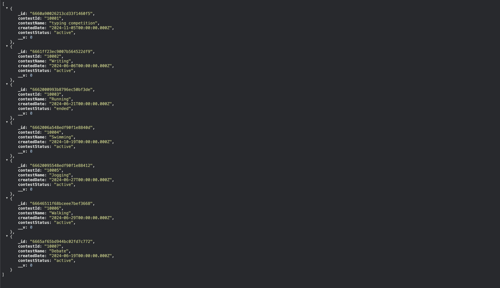
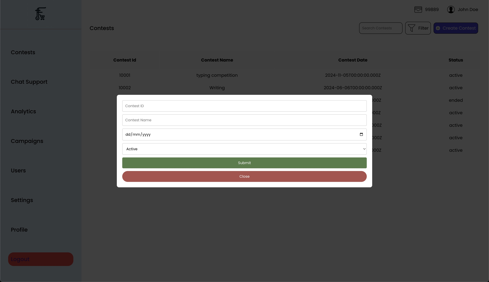
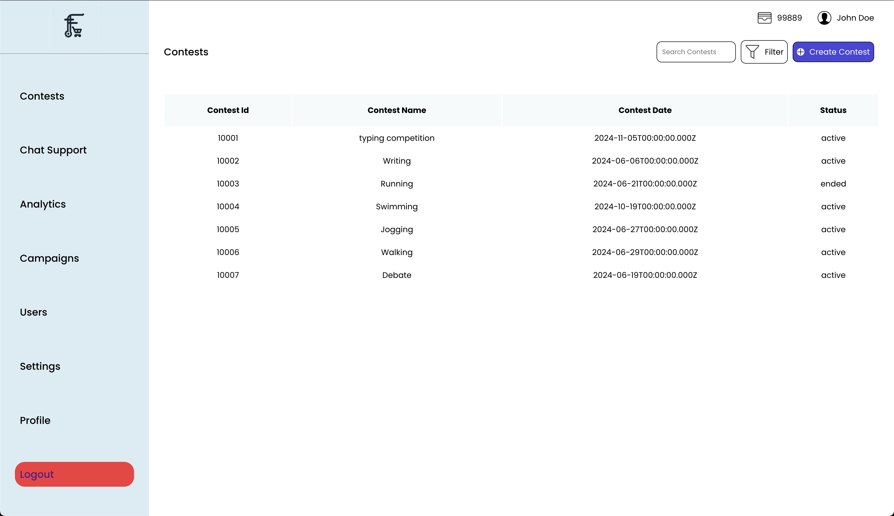

# Finark-Web

---

Creating a web application to save contests in MongoDB and develop an API for integration with an Android App.

## General Information

---

- This project has a frontend and backend set; the backend has been deployed and the API can be used to find the contests.

## Technologies Used

---

- CSS
- React
- NodeJS
- Express
- MongoDB

## API

---

- [API Link For Contests](https://finark-backend.vercel.app/api/contest)
- `/api/contest`

## Working

---

## Screenshots

---

## Steps

---

- Install the Node Modules
- Start the Backend Server or use the API
- Start Frontend

## Contact

---

